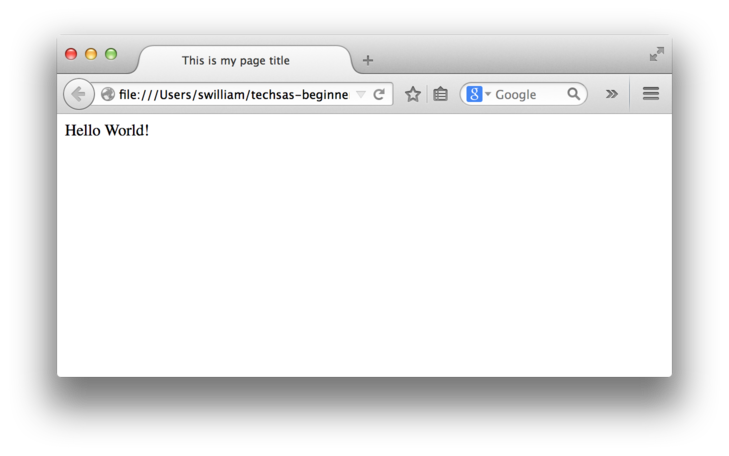
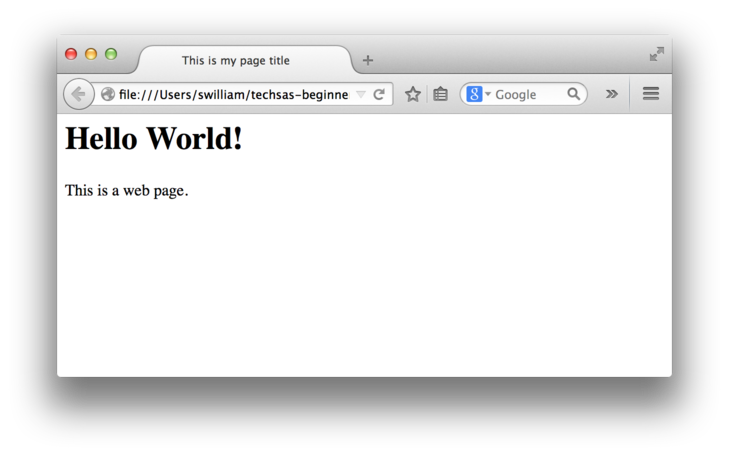

Hello and welcome to the Beginner's Guide to the fundamentals of web development!

## Why the web?

Before we start teaching the wonderful world of web development, let's try to
inspire you with the why.

The web is a very interesting place, for many different reasons.  It is a
platform that unifies all computers, tablets, and smart phones.  There is no
other single technology that you can learn to accomplish the same reach of a
web app.  Web apps work everywhere.

This is why so many are betting on the web, and why the developer community is
thriving.  The web developer culture is one of openness, sharing, and brilliance.
StackOverflow will answer most of your questions, and nearly every tool you
need to use to build a state of the art app is free and open source.

Welcome to the modern utopia of web development!  Let's get started.

## First Steps

Let us learn by doing!

### Create

Create an empty folder anywhere and create an `index.html` file inside it with _Sublime
Text Editor_. Paste the following text:

```
<html>
  <head>
  <title>This is my page title</title>
  </head>
  <body>
    Hello World!
  </body>
</html>
```


### See

Now open the file in a web browser.  You should see this!




### Review

You just created a web page using "HTML".  Notice that everything inside
__angle brackets__ denotes special code.  For example, everything inside
`<html>` and `</html>` denotes an HTML page.

Likewise, everything inside `<title>` and `</title>` will be the title
of the web page (see it in the screenshot above?)

Everything inside `<body>` and `</body>` will constitute the actual content
of the page.

You should start noticing a pattern here.  Everything inside `<SOMETHING>` and
`</SOMETHING>` will be used for a certain purpose, depending on its name.

## Manipulate content

Now let's change the body a little bit.

### Create

Edit the content of `index.html` to be the following:

```
<html>
  <head>
  <title>This is my page title</title>
  </head>
  <body>
    <h1>Hello World!</h1>
    This is a web page.
  </body>
</html>
```

### See



### Review

Notice that the "Hello World!" is bigger than the rest of the text.

This is because we wrapped "Hello World!" in `<h1>` and `</h1>`, which
is used to denote top-level header text.

## Use the Inspector!

### Do

### See

### Review
